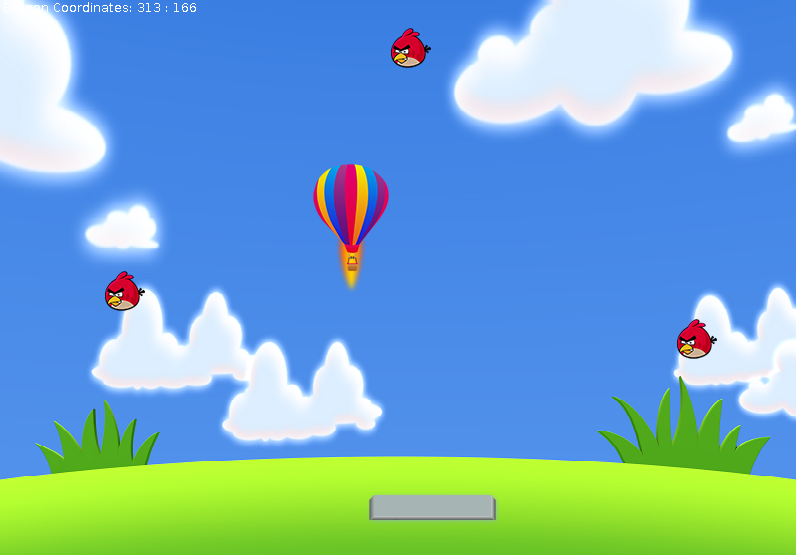
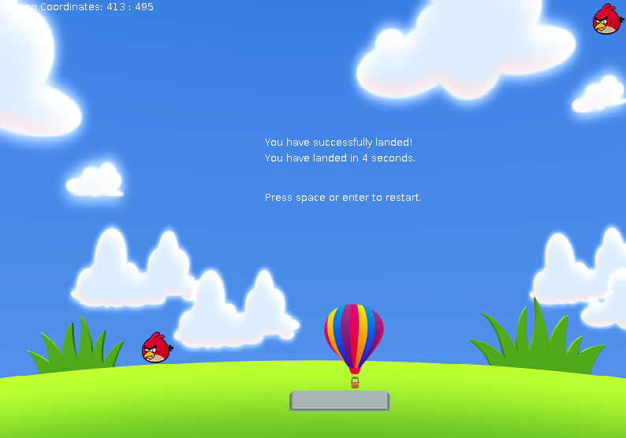

# Air Balloon

This is a Java based simple game where the main goal is to successfully land the Air Balloon in the fixed area by maintaining its falling speed using the arrow keys while avoiding the birds. This project uses the concepts of Object Oriented Programming and was done as a lab project for the course Object Oriented Programming with Java.

## Getting Started
Java Runtime Environment should be installed inorder to run the game. The following command starts the application.

```
java -jar AirBalloonLanding.jar
```



